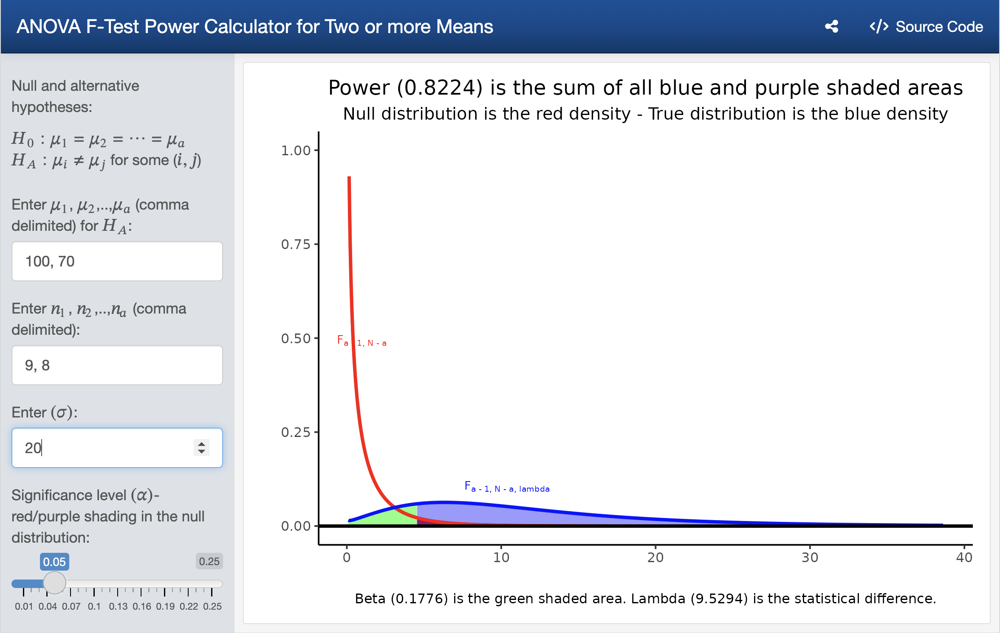
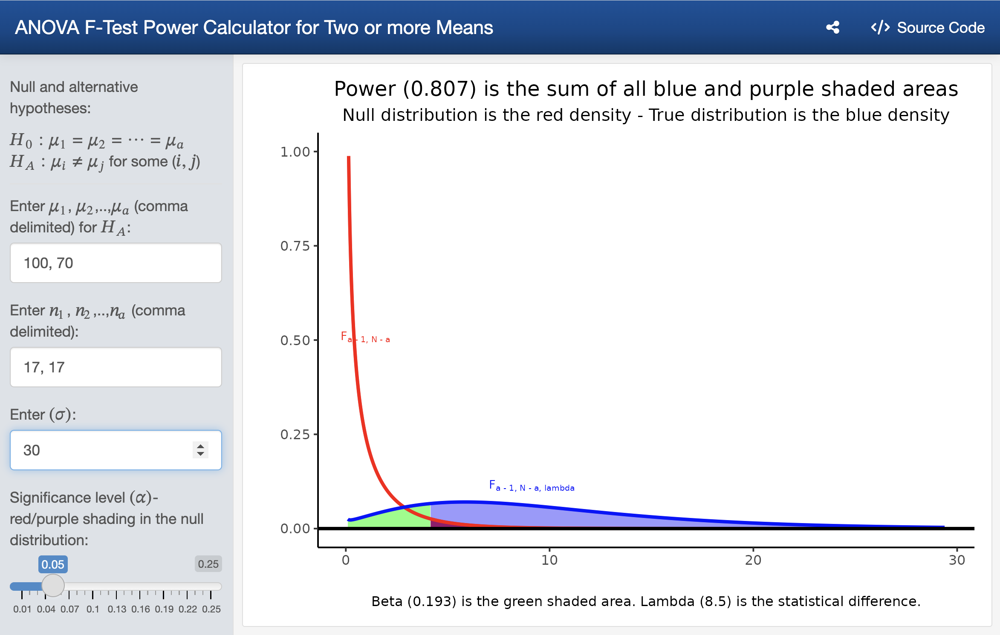

```{r label = "setup", include = FALSE}
knitr::opts_chunk$set(echo = TRUE, fig.align = "center", comment = NA, warning = FALSE, message = FALSE)
```

```{r, label = "BibMagic", include = FALSE}
PackagesUsed <- c("ggplot2", "bookdown", "shiny", "base")
# Write bib information
knitr::write_bib(PackagesUsed, file = "./packages.bib")
# Load packages
lapply(PackagesUsed, library, character.only = TRUE)
```


# INTRODUCTION {-}

Following the GAISE guidelines [@gaise2016], many instructors have added assessments in the form of small projects to the end of their courses to improve and evaluate student learning.  It has been our observation that students will often select one of the last topics they have covered in their course for a project, often comparing many means when given the opportunity.  When comparing many means, it is important the study allocate sufficient subjects/experimental units to each treatment to be able to detect differences in treatment means when those differences exist (power).  The Shiny package [@R-shiny] can be used to create web based applications.  The concept of power and its relationship to sample size for a single sample via a Shiny app was discussed in @arnholtPOWER.  This work shows how the noncentrality parameter ($\lambda$) is a measure of statistical difference between **population** means and how the $F$ value computed in an ANOVA table is a measure of statistical difference between **sample** means. A Shiny app is presented where students can experiment  with different design structures (i.e. different sample sizes for each of the $a$ treatments) to ensure their experiments attain satisfactory power. The notation used for the one-way completely randomized design follows that presented in @ugarte_probability_2015.  To aid with the connection between noncentrality parameters and test statistics, it is shown how the pooled variance $t$-test is a special case of the $F$-test when there are ($a = 2$) treatments before generalizing to $a >= 2$ treatments.  


# STATISTICAL BACKGROUND {-}


The observations in a completely randomized design (CRD) can be described with a linear statistical model
\begin{equation}
Y_{ij} = \mu + \tau_i + \epsilon_{ij} \text{ for }i=1, 2, \dots, a \text{ and } j
=1, 2, \dots, n_a
(\#eq:EDMeq)
\end{equation}
where $Y_{ij}$ is the $j^\text{th}$
observation of the $i^\text{th}$ treatment, $\mu$ is a parameter common to all
treatments called the overall mean, $\tau_i$ is a parameter unique to the
$i^\text{th}$ treatment called the $i^\text{th}$ treatment effect, and
$\epsilon_{ij}$ is a random error component. For hypothesis testing, the model
errors are assumed to be normally and independently distributed with mean zero
and constant standard deviation $\bigl(NID(0, \sigma)\bigr)$.  Although estimating the parameters for Model \@ref(eq:EDMeq) is possible, the goal of the experimenter is typically to discern whether or not the $a$ treatment means are equal.  The hypotheses of interest are

\begin{equation}
H_0: \mu_1=\mu_2= \dots = \mu_a\quad\text{ versus }\quad H_1:\mu_i \ne \mu_j \text{ for some }(i, j).
(\#eq:HYP)
\end{equation}

The notation that follows is adopted from @ugarte_probability_2015. The sum of the observations in the $i^\text{th}$ treatment group is $Y_{i\bullet}=\sum_{j=1}^{n_i} Y_{ij}$, and the mean of the observations in the
$i^\text{th}$ treatment group is $\bar{Y}_{i\bullet}=\frac{1}{n_{i}}\sum_{j=1}^{n_i}
Y_{ij} = \frac{Y_{i\bullet}}{n_i}$. The bar indicates a mean while the dot
$(\bullet)$ indicates that values have been added over the indicated subscript.
The sum of all observations is $Y_{\bullet\bullet}=\sum_{i=1}^a \sum_{j=1}^{n_i}
Y_{ij}.$ The grand mean of all observations is denoted $\bar{Y}_{\bullet\bullet}=\frac{1}{N}\sum_{i=1}^a
\sum_{j=1}^{n_i}Y_{ij}=\frac{Y_{\bullet\bullet}}{N}.$ For $a = 2$ treatments, the typical sum of squares for testing the hypotheses in \@ref(eq:HYP) are shown to the left of the equivalence ($\equiv$) symbol in \@ref(eq:AltFeq).  The representation on the right side of the $\equiv$ in \@ref(eq:AltFeq) is the standard test statistic used to test two means when variances are assumed to be equal.  To verify the equivalence, keep in mind that $\sum_{j=1}^{n_i} Y_{ij} = n_i \bar{Y}_{i\bullet}
 \text{ for } i=1,2$ and $(n_1 + n_2) \bar{Y}_{\bullet\bullet} = \sum_{i=1}^2
\sum_{j=1}^{n_i} Y_{ij}$.

\begin{equation}
F = \frac{MS_\text{Treatment}}{MS_\text{Error}} = \dfrac{\dfrac{\sum_{i=1}^2
\sum_{j=1}^{n_i} (\,\bar{Y}_{i\bullet} - \bar{Y}_{\bullet\bullet})^2}{
df_\text{Treatment}}}{\dfrac{\sum_{i=1}^2 \sum_{j=1}^{n_i}(\, Y_{ij}-
\bar{Y}_{i\bullet})^2}{ df_\text{Error}}} \equiv \dfrac{(\,\bar{Y}_{1\bullet}
-\bar{Y}_{2\bullet})^2 \left( \frac{1}{n_1} + \frac{1}{n_2} \right)^{-1}}{S^2_p}
(\#eq:AltFeq)
\end{equation}

Rewriting the right side of \@ref(eq:AltFeq) yields

\begin{equation}
F = \dfrac{(\,\bar{Y}_{1\bullet} -\bar{Y}_{2\bullet})^2 }{S^2_p\left( \frac{1}{n_1} +
\frac{1}{n_2} \right)} = \left[ \dfrac{(\,\bar{Y}_{1\bullet} -\bar{Y}_{2\bullet}) }{S_p
\sqrt{ \frac{1}{n_1} + \frac{1}{n_2}}} \right]^2 = [t]^2.
(\#eq:tsqEQ)
\end{equation}

The quantity in \@ref(eq:AltFeq) measures the statistical differences between **sample** means. Let $SS_\text{Hypothesis}(\text{population})$ be the sum of squares for  treatments 
obtained by replacing $\bar{Y}_{1\bullet}$ with $\mu_1$, $\bar{Y}_{2\bullet}$ with 
$\mu_2$, and $\bar{Y}_{\bullet\bullet}$ with $\frac{n_1\mu_1+n_2\mu_2}{n_1+n_2}$. 
Then, replacing the sample means in \@ref(eq:AltFeq) with the population means yields

\begin{equation*}
\lambda =  \frac{ ( \mu_1 - \mu_2 )^2\left( \frac{1}{n_1} + \frac{1}{n_2}
\right)^{-1} }{\sigma^2} = \frac{SS_\text{Hypothesis}(\text{population})}{\sigma^2}.
\end{equation*}


# EXAMPLE 1{-}

The following scenario can be given to students:

Consider a ficticious experiment where one of two hormones (testosterone or isoandrostenolone) is administered for fifteen days to male chicks starting when the chicks are one day old.  At the end of the fifteen days, the experimenter hypothesizes the average weight of chicks that receive testosterone will be 100 mg and that the average weight of chicks that receive isoandrostenolone will be 70 mg.  Based on previous work, the researcher estimates the standard deviation for both groups of chicks to be somewhere between 20 mg and 30 mg.  What is the minimum number of chicks that should be assigned to each group to obtain a power for the test of at least 0.80 using $\alpha = 0.05$? 

## Solution using base R functions {-}

Although R [@R-base] is used as the computational engine in what follows, most modern software packages can handle what is shown in the code. Start by asking the students to specify the null and alternative hypotheses they will use to test the two hormones.  The hypotheses are: 
$$H_0: \mu_\text{testosterone} = \mu_\text{isoandrostenolone}\quad\text{ versus }\quad \mu_\text{testosterone} \neq \mu_\text{isoandrostenolone}.$$
Since the researcher specified a range for $\sigma$, two sets of values will be computed one for when the value of $\sigma$ is 20 mg and one for when the value of $\sigma$ is 30 mg. Start by finding a critical value for which the null hypothesis will be rejected at the $\alpha = 0.05$ level with a guess of $n_1 = n_2 = 10$.  That is we are looking for $F_{0.95, 2 - 1, 10 + 10 -2} = F_{0.95, 1, 18} = `r qf(0.95, 1, 18)`$.  Next compute the noncentrality parameter when $\sigma = 20$ mg.

\begin{align*}
\lambda &=  \frac{ ( \mu_1 - \mu_2 )^2\left( \frac{1}{n_1} + \frac{1}{n_2}
\right)^{-1} }{\sigma^2} = \frac{SS_\text{Hypothesis}(\text{population})}{\sigma^2} \\
&= \frac{\sum_{1 = 1}^an_i(\mu_{i\bullet} - \bar{\mu}_{\bullet\bullet})^2}{\sigma^2} = \frac{10(100 - 85)^2 + 10(70 - 85)^2}{20^2} = 11.25
\end{align*}

$$\text{Power}(\lambda = 11.25) = P(F^*_{1, 18, \lambda = 11.25} \geq f_{0.95, 1, 18} = `r qf(0.95, 1, 18)`) = `r pf(qf(0.95, 1, 18), 1, 18, 11.25, lower = FALSE)`$$
```{r}
(CriticalF <- qf(0.95, 2 - 1, 20 - 2))
# Power for lambda
(pf(CriticalF, 2 - 1, 20 - 2, 11.25, lower = FALSE) -> POWER)
```


Since we only need to achieve a power of 0.80, we can reduce the values for each sample.  Next, we consider using $n_1 = 9$ and $n_2 = 8$ when $\sigma = 20$ mg. 

\begin{align*}
\lambda &=  \frac{ ( \mu_1 - \mu_2 )^2\left( \frac{1}{n_1} + \frac{1}{n_2}
\right)^{-1} }{\sigma^2} = \frac{SS_\text{Hypothesis}(\text{population})}{\sigma^2}\\
&= \frac{\sum_{1 = 1}^an_i(\mu_{i\bullet} - \bar{\mu}_{\bullet\bullet})^2}{\sigma^2} = \frac{9(100 - 85)^2 + 8(70 - 85)^2}{20^2} = 9.5625
\end{align*}

$$\text{Power}(\lambda = 9.5625) = P(F^*_{1, 15, \lambda = 9.5625} \geq f_{0.95, 1, 15} = `r qf(0.95, 1, 15)`) = `r pf(qf(0.95, 1, 15), 1, 15, 9.5625, lower = FALSE)`$$
```{r}
(CriticalF <- qf(0.95, 2 - 1, 9 + 8 - 2))
# Power for lambda
(pf(CriticalF, 2 - 1, 9 + 8 - 2, 9.5625, lower = FALSE) -> POWER)
```

The same calculations are performed next under the assumption that $\sigma = 30$ mg.

\begin{align*}
\lambda &=  \frac{ ( \mu_1 - \mu_2 )^2\left( \frac{1}{n_1} + \frac{1}{n_2}
\right)^{-1} }{\sigma^2} = \frac{SS_\text{Hypothesis}(\text{population})}{\sigma^2} \\
&= \frac{\sum_{1 = 1}^an_i(\mu_{i\bullet} - \bar{\mu}_{\bullet\bullet})^2}{\sigma^2} = \frac{10(100 - 85)^2 + 10(70 - 85)^2}{30^2} = 5
\end{align*}

$$\text{Power}(\lambda = 5) = P(F^*_{1, 18, \lambda = 5} \geq f_{0.95, 1, 18} = `r qf(0.95, 1, 18)`) = `r pf(qf(0.95, 1, 18), 1, 18, 5, lower = FALSE)`$$
```{r}
(CriticalF <- qf(0.95, 2 - 1, 20 - 2))
# Power for lambda
(pf(CriticalF, 2 - 1, 20 - 2, 5, lower = FALSE) -> POWER)
```


Since we need to achieve a power of 0.80, we need to increase the values for each sample.  Next, we consider using $n_1 = 17$ and $n_2 = 17$ when $\sigma = 30$ mg. 

\begin{align*}
\lambda &=  \frac{ ( \mu_1 - \mu_2 )^2\left( \frac{1}{n_1} + \frac{1}{n_2}
\right)^{-1} }{\sigma^2} = \frac{SS_\text{Hypothesis}(\text{population})}{\sigma^2}\\
&= \frac{\sum_{1 = 1}^an_i(\mu_{i\bullet} - \bar{\mu}_{\bullet\bullet})^2}{\sigma^2} = \frac{17(100 - 85)^2 + 17(70 - 85)^2}{30^2} = 8.5
\end{align*}

$$\text{Power}(\lambda = 8.5) = P(F^*_{1, 32, \lambda = 8.5} \geq f_{0.95, 1, 32} = `r qf(0.95, 1, 32)`) = `r pf(qf(0.95, 1, 32), 1, 32, 8.5, lower = FALSE)`$$
```{r}
(CriticalF <- qf(0.95, 2 - 1, 17 + 17 - 2))
# Power for lambda
(pf(CriticalF, 2 - 1, 17 + 17 - 2, 8.5, lower = FALSE) -> POWER)
```
If the standard deviation for chick weight is $\sigma = 30$ mg, the experimenter needs to have 17 chicks assigned to each group to detect mean differences between groups greater than 80% percent of the time.  If the standard deviation for chick weights is as small as $\sigma = 20$ mg, the experimenter can assign 9 chicks to the first group and 8 chicks to the second group and still detect mean differences greater than 80% of the time.  To save space, we selected the values of $n_1$ and $n_2$ that solved the problem for the different values of $\sigma$.  Next we show how to compute the non-centrality parameter $\lambda$ using the notion of the $SS_\text{Hypothesis}(\text{population})$ using R, but which will work with any statistical software that computes the sum of squares.   


```{r}
# Hypothesized means
hypmeans <- c(100, 70)
# Number of treatments
a <- length(hypmeans) 
n1 = 17
n2 = 17
# Total number of experimental units
N <- n1 + n2 
# Degrees of freedom for error
dferror <- N - a
# Sigma value
sigma <- 30
# Create n1 values of 100 and n2 values of 70 and store in Y
Y <- rep(hypmeans, times = c(n1, n2))
# Create a treatment factor with n1 values of testosterone 
# and n2 values of isoandrostenolone
Treat <- factor(rep(c("testosterone", "isoandrostenolone"), 
                    times = c(n1, n2)))
# Compute SS for ANOVA
summary(aov(Y ~ Treat))
# Pull out the SS Treat value and assign to SShyp
(summary(aov(Y ~ Treat))[[1]][1, 2] -> SShyp) 
# Noncentrality parameter
(lambda <- SShyp/sigma^2)
(CriticalF <- qf(0.95, a - 1, N - a))
# Power for lambda
(pf(CriticalF, a-1, dferror, lambda, lower = FALSE) -> POWER)
```

## Solution using the Shiny app{-}

To find the required samples sizes to test $H_0: \mu_\text{testosterone} = \mu_\text{isoandrostenolone}\quad\text{ versus }\quad \mu_\text{testosterone} \neq \mu_\text{isoandrostenolone}$ when $\sigma = 30$ mg, launch the Shiny app [@R-shiny] found at [https://shinyapp](https://shinyapp) and enter the values of 100 and 70 separated with a comma in the $H_A$ box, 10 and 10 separated with a comma in the $n_1, n_2, n_a$ box, the value of 20 in the $\sigma$ box, and use the slider to select a significance level of 0.05 as shown in Figure \@ref(fig:power1).  Change the values for $n_1$ and $n_2$ to be as small as possible with a power value of at least 0.80.

```{r, echo = FALSE, label = power1, fig.cap = "Power to detect a specified difference in means with given sample sizes and population standard deviation"}

```

The red density in Figure \@ref(fig:power1) depicts a central *F*-distribution with $2 - 1$ and $20 - 2 = 18$ degrees of freedom.  The blue density in Figure \@ref(fig:power1) is a non-central *F*-distribution with $2-1$ and $20-2 = 18$ degrees of freedom and non-centrality parameter ($\lambda = 11.25)$.  The purple shaded area in Figure \@ref(fig:power1) is the significance level and the sum of all blue and purple shaded areas is the power (0.887). Changing the values for $n_1$ and $n_2$ to either 8 and 9 or 9 and 8 results in a power of (0.8224) as shown in Figure \@ref(fig:power2).

```{r, echo = FALSE, label = power2, fig.cap = "Power to detect a specified difference in means with given sample sizes and population standard deviation"}

```

Finally, have the students verify that the minimum samples sizes for $n_1$ and $n_2$ are both 17 when $\sigma = 30$ using the Shiny app as shown in Figure \@ref(fig:power3).

```{r, echo = FALSE, label = power3, fig.cap = "Power to detect a specified difference in means with given sample sizes and population standard deviation"}

```

# EXAMPLE 2{-}

An educational researcher is interested in testing different tools to help his students master statistical concepts.  The researcher hypothesizes there will be an increasing in mean performance for students on a standardized test from lecture alone (70), to lecture with statistical software (75), to lecture with statistical software and videos (80), to lecture with statistical software, videos, and shiny apps of (85).  If the population standard deviation for the researcher's students on the standardized test is 15, find the minimum number of students required for each group to be able to have a power value of at least 0.80.

Figure \@ref(fig:power4) shows 70, 75, 80, and 85 entered for $\mu_1$, $\mu_2$, $\mu_3$, and $\mu_4$ in the $H_A$ box, the value of 15 in the $\sigma$ box, and sliding the significance level to 0.05.  Power is maximized when all treatment groups have the same number of experimental units.  Consequently, if there are no restrictions on the allocation of resources, the experimenter should allocate an equal number of experimental units to each of the $a$ treatments. Then, experiment with different values for the sample sizes for each treatment until the power is greater than or equal to 0.80.  Our trial and error method started with $n_1 = n_2 = n_3 = n_4 = 10$ which yielded too small a power.  As a guess, we doubled the values to $n_1 = n_2 = n_3 = n_4 = 20$ and noted we were just a little short of our desired power value.  Next we tried $n_1 = n_2 = n_3 = n_4 = 25$ and observed this was over the target value of 0.80.  We continued experimenting lowering the values until we arrived at $n_1 = n_2 = n_3 = n_4 = 21$ which returned a power of 0.8082.

```{r, echo = FALSE}
DF <- data.frame(n = c(10, 20, 25, 22, 21), Power = c(0.4396, 0.7856, 0.8797, 0.8287, 0.8082))
knitr::kable(DF, caption = "Process of trial and error for desired power", booktabs = TRUE)
```


**Answer:** $n_1 = n_2 = n_3 = n_4 = 21$.

```{r, echo = FALSE, label = power4, fig.cap = "Power to detect a specified difference in means with given sample sizes and population standard deviation"}

```

We note in passing that computing power for full-rank general linear models is also possible using the same paradign where $\lambda = \frac{SS_\text{Hypothesis}(\text{population})}{\sigma^2}$.  For details see section 12.10 of @ugarte_probability_2015.  

# References {-}